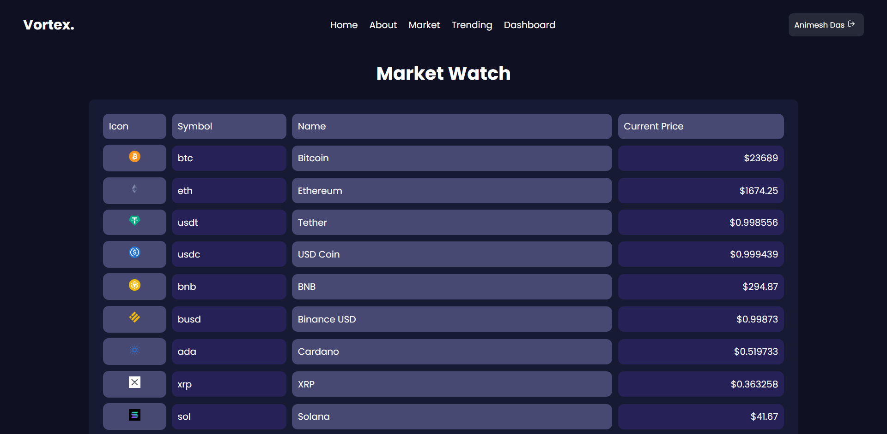

# Vortex - Crypto and Stock Market Tracker

[Live Demo](https://vortex-tracker.web.app/)

This project was bootstrapped with [Create React App](https://github.com/facebook/create-react-app).

## Run on Local Device

- `npm install`
- `npm start`
- Add firebase variables to .env (.env.sample for reference)

The development server starts on [http://localhost:3000](http://localhost:3000) :rocket:

## Attributions

[Coingecko API](https://coingecko.com/en/api/documentation)

## SneakPeak

